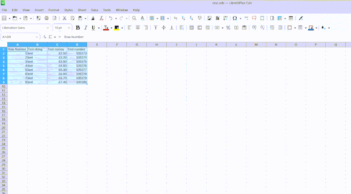

### calc2md

In a similar fashion to calc2LaTeX, this macro makes it simple to turn libreoffice data into plaintext for use in markdown documents.  
Simply select the area you would like to turn into a table, then run the macro.

## Demonstration

